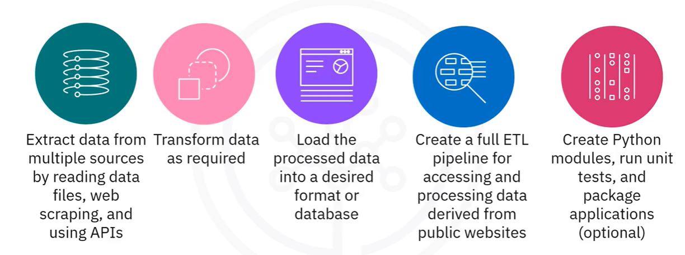

# Python Project for Data Engineering

## Introduction

A project assuming the role of a data engineer which deals with real-world data
problems that dives into:

   1. Extraction of data from multiple sources by reading data files, web scraping, and using APIs
   2. Transform data as required
   3. Load the processed data into a desired format or database 
   4. Create a full ETL pipeline for accessing and processing data derived from public websites
   5. Create Python modules, run unit test, and pacakge applications

## Project Objectives 

## ETL Process using Python

1. Read CSV, JSON, and XML file types.
2. Extract the required data from the different file types.
3. Transform data to the required format.
4. Save the transformed data in a ready-to-load format, which can be loaded into an RDBMS.

## Web scraping and Extracting Data using APIs

1. Use the [requests], [BeautifulSoup] and [pandas] libraries to web scrape the contents of a web page.
2. Analyze the HTML code of a webpage to find relevant information.
3. Extract the relevant information and save in a CSV file.
4. Load the dataframe into a SQL Database.

## Python Initialized Database

1. Create modules
2. Run unit test 
3. Package applications
4. Static code analysis